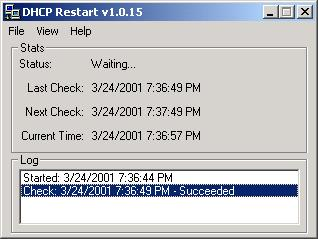



## DHCP Restart

### Description

This utility will check your dhcp connection on a timed interval by pinging a server of your choice. If the ping fails, it will release then renew your dhcp settings.
 
### More Info
 

             |
---                |---
**Submitted On**   |2001-03-24 10:04:06
**By**             |[PHendryx](https://github.com/Planet-Source-Code/PSCIndex/blob/master/ByAuthor/phendryx.md)
**Level**          |Advanced
**User Rating**    |3.8 (19 globes from 5 users)
**Compatibility**  |VB 4\.0 \(32\-bit\), VB 5\.0, VB 6\.0
**Category**       |[Complete Applications](https://github.com/Planet-Source-Code/PSCIndex/blob/master/ByCategory/complete-applications__1-27.md)
**World**          |[Visual Basic](https://github.com/Planet-Source-Code/PSCIndex/blob/master/ByWorld/visual-basic.md)
**Archive File**   |[CODE\_UPLOAD175163242001\.zip](https://github.com/Planet-Source-Code/phendryx-dhcp-restart__1-21906/archive/master.zip)

